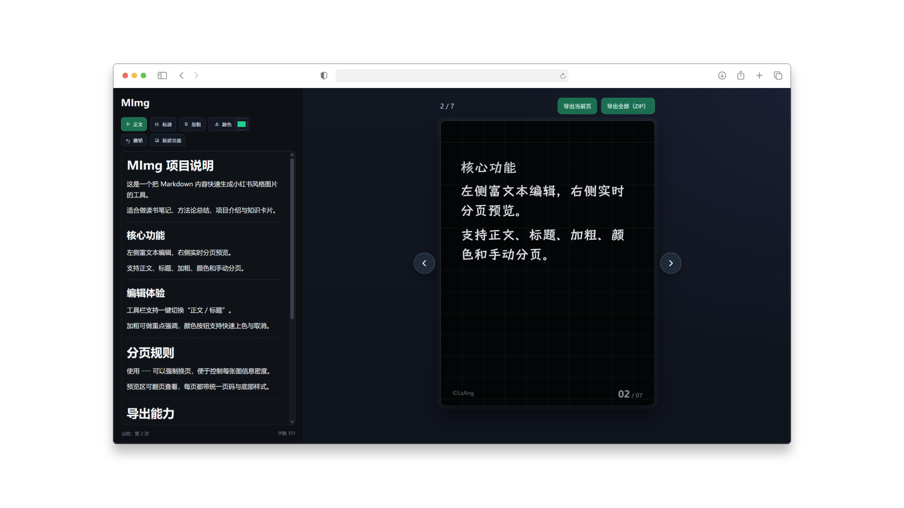

# xhs-img

一个基于 `Vue + Markdown` 的小红书图文生成工具：左侧编辑内容，右侧实时分页预览，并支持一键导出 PNG（单页或 ZIP）。



> 这是作者第一次通过 **AI Codex** 协作完成的项目。

## 快速开始

```bash
npm install
npm run dev
```

## 主要功能

- Markdown 编辑与分页预览
- 导出当前页 PNG
- 导出全部页面 ZIP
- 可配置页脚作者信息
